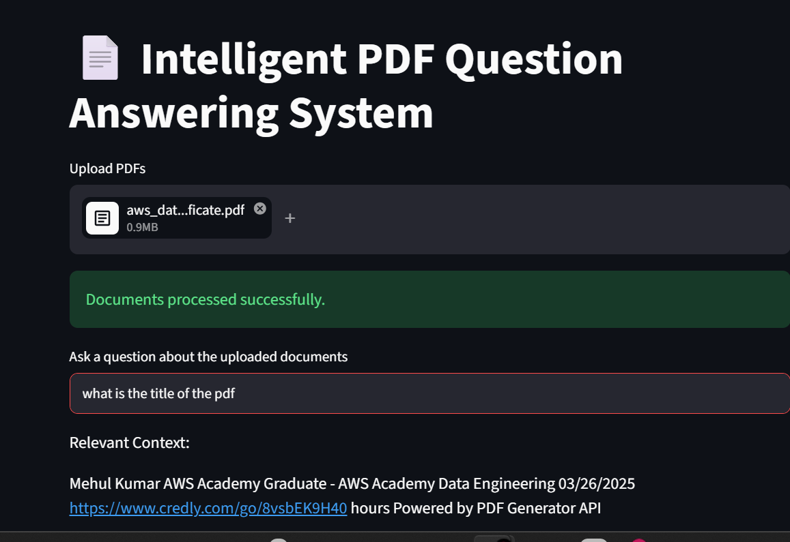

# Intelligent PDF Question Answering System

## Demo



## Overview

An NLP-based document intelligence system that allows users to upload PDF files and query them using natural language.

## Features

- PDF text extraction
- Semantic search using Sentence Transformers
- Vector similarity search using FAISS
- Interactive Streamlit interface
- Multi-document support

## Tech Stack

- Python
- Streamlit
- Sentence Transformers
- FAISS
- PyPDF2

## How It Works

1. Upload PDF documents
2. Extract text from PDFs
3. Generate embeddings
4. Store embeddings in FAISS
5. Ask questions
6. Retrieve relevant content

## Run Locally

```bash
pip install -r requirements.txt
streamlit run app.py
```

## Author

Mehul Kumar